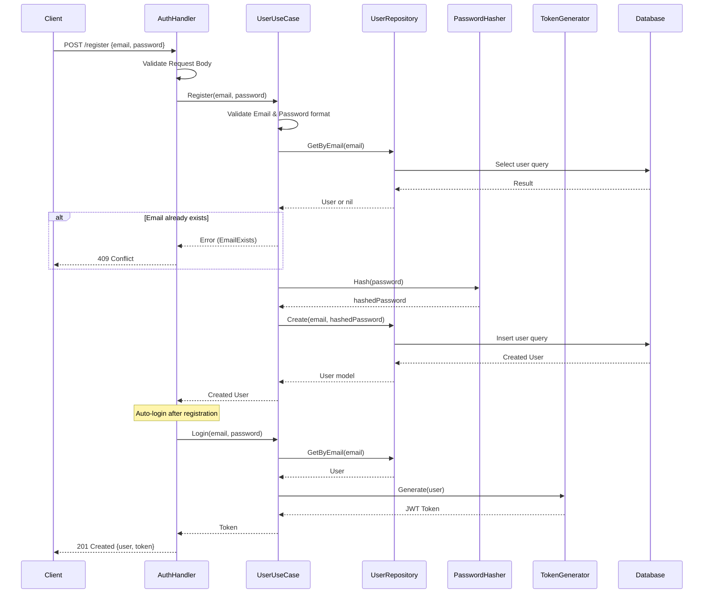
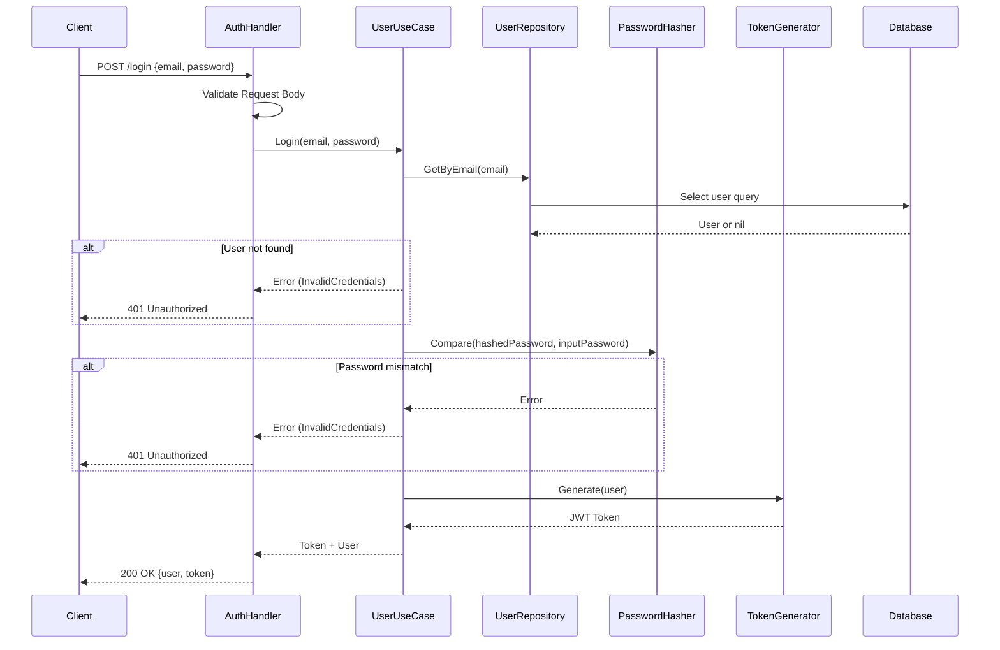

# Authentication Flow Visualization

This document visualizes the current authentication architecture and flows in the `devnorth-back` application.

## Architecture Component Diagram

The application follows a clean architecture with dependency injection.

```mermaid
graph TD
    Client[Client] --> Router[HTTP Router (Chi)]
    Router --> AuthHandler[Auth Handler]
    
    subgraph "Domain Layer"
        UserUseCase[User UseCase]
        UserRepoInterface[User Repository Interface]
    end
    
    subgraph "Infrastructure Layer"
        UserRepoImpl[User Repository Implementation]
        HashService[Bcrypt Hasher]
        TokenService[JWT Generator]
        DB[(PostgreSQL)]
    end

    AuthHandler --> UserUseCase
    UserUseCase --> UserRepoInterface
    UserUseCase --> HashService
    UserUseCase --> TokenService
    
    UserRepoInterface -.-> UserRepoImpl
    UserRepoImpl --> DB
```

## Registration Flow (`POST /api/v1/auth/register`)



## Login Flow (`POST /api/v1/auth/login`)



## Current State Notes

- **Token Generation**: JWT tokens are generated upon successful Login and Registration.
- **Password Security**: Passwords are hashed using Bcrypt (cost 10) before storage.
- **Middleware**: Currently, there is no HTTP middleware implemented to verify the JWT token on protected routes.
